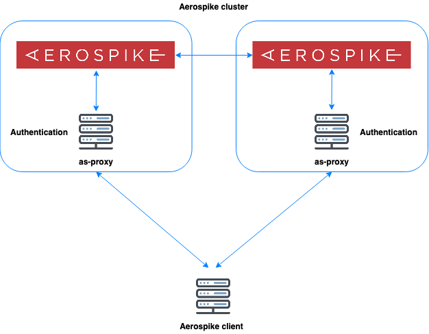

# Aerospike Proxy



Aerospike community version doesn't support authentication

`as-proxy` was born to resolve this issue

It handle login/authenticate requests from aerospike client then validate and proxy requests to Aerospike server 

### Example config:

```yaml
# keep alive period: default 60s
keepalive_period: 60
# connect timeout: default 10s
connect_timeout: 10
# format: user: password
auths:
  admin: admin123
  test: test123

# list of aerospike server and proxy
# proxy will response proxy addr instead of aerospike server addr
# in request get peers: peers-clear-std
as_cluster:
  "10.1.0.2:7000": 10.1.0.2:3000
  "10.1.0.3:7000": 10.1.0.3:3000
```

### Usage

```
./as-proxy -h                                                                                                                                                              16.5s  Thu Jun 25 14:54:09 2020
Usage of ./as-proxy:
  -backend string
        backend server (default "127.0.0.1:7000")
  -config string
        config file (default "./as-proxy.yml")
  -debug
        debug mode
  -listen string
        listen address (default ":3000")
```


